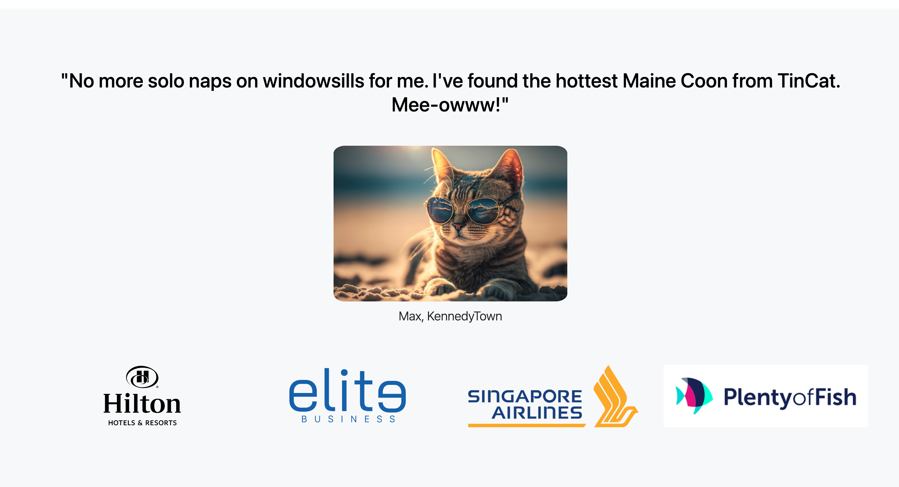

# TinCat - The Feline Dating App

Welcome to the official repository for TinCat, the feline dating app where local kitties find their purr-fect match. Our application provides an intuitive platform for our feline friends to meet, socialize, and fall in love. This README serves as a guide to the structure and setup of the project.

## Project Overview

TinCat is a responsive web application built with Bootstrap, providing a seamless and intuitive user experience across all devices. The app features a vibrant gradient background, playful icons, and a gallery of charming cat profiles.

### Features

- **Gradient Background**: A beautiful and animated gradient that provides a lively backdrop to the user experience.

  

- **Responsive Layout**: Fully responsive design that looks great on desktop and mobile phones.

- **Testimonials**: Real-world success stories from happy felines who've found love through TinCat.

- **Pricing Plans**: Multiple subscription options tailored to fit the needs of every cat.

## Getting Started

To get started with the TinCat project, check it out here: [TinCat](https://qwerac388.github.io/TinCat/)

### Project Structure

- **index.html**: The main HTML document with structural layout and content for the TinCat app.
- **style.css**: Contains custom styles, including the gradient background and keyframes for animation.
- **bootstrap**: This directory contains Bootstrap CSS file necessary for the responsive design and components.
