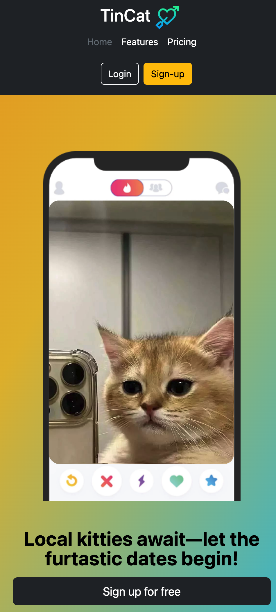

# TinCat - The Feline Dating App

Welcome to the official repository for TinCat, the premier feline dating app. TinCat is designed as a full-stack web application that enables local kitties to find their purr-fect match through a seamless user experience. This README provides a comprehensive guide to understanding the project's structure, setup, and particularly its full-stack capabilities, including user account management and database interactions.

## Full-Stack Functionality

TinCat leverages the power of Bootstrap for front-end responsiveness, Node.js for server-side logic, and PostgreSQL for robust data management. This combination ensures a seamless and efficient platform where users can:

- **Sign Up**: Create new user accounts. The registration process captures user information and stores it securely in our PostgreSQL database, ensuring that each account is unique and protected.
- **Log In**: Return users can log in using their credentials. The authentication process is managed through Node.js, interfacing with PostgreSQL to retrieve and verify user data.
- **Checkout Page**: Users interested in purchasing the Elite Plan can use a promo code for discounts, fill out billing information, and complete their transactions. The checkout process is backed by our secure server-side logic, ensuring that all transactions are handled safely and efficiently.
- **Error Handling**: Comprehensive error handling is included to ensure a smooth user experience. This includes validation of promo codes during checkout, unique constraints on usernames and emails during registration, and proper feedback for login issues like incorrect passwords or unrecognized email addresses.

### Project Overview

TinCat is not just about beautiful interfaces; it's about creating a robust application that handles real-world user data efficiently and securely. The app features a vibrant gradient background, playful icons, and a gallery of charming cat profiles, enhancing the overall user experience across all devices.

### Features

- **Gradient Background**: A beautiful and animated gradient that provides a lively backdrop to the user experience.

  

---

- **Responsive Layout**: Fully responsive design that looks great on desktop and mobile phones.

  

---

- **User Registration**: Users can sign up on the Sign Up page. The user's information is stored in a PostgreSQL database.

  

---

- **Login Page**: On the Login page, users can enter their credentials. If authenticated successfully, they are redirected to the homepage with a personalized welcome message.

  

  

---

- **Checkout Page**: Users interested in the Elite Plan can use a promo code for a $10 discount, fill out billing information, and are redirected to a payment success page.

---

- **Newsletter Subscription**: Users can subscribe to the TinCat newsletter from the homepage. Upon successful subscription, a confirmation message pops up to alert the user.

# Security and Session Management

To enhance security, TinCat uses bcrypt for encrypting passwords and manages user sessions with cookies that last for 24 hours. Additionally, environment variables are used for sensitive configurations.

## Password Encryption

Passwords are hashed using bcrypt with a salt round of 10, ensuring that user credentials are stored securely in the database.

## Session Management

User sessions are managed with cookies that have a 24-hour expiration period. This ensures that users can remain logged in for a day without needing to re-enter their credentials.

## Environment Variables

Sensitive information, such as database credentials and session secrets, are managed using environment variables. This prevents exposure of critical data in the codebase.

# Error Handling in TinCat

TinCat implements robust error handling to ensure a smooth user experience during account creation, login, and promotional code redemption processes. Below are details on how specific errors are managed.

## Promo Code Validation

During the checkout process, users can enter promo codes to receive discounts on their purchases. If a user enters an invalid promo code, the system will display an error message:

- **Error Condition**: Invalid or expired promo code entered.
- **User Feedback**: A pop-up message stating "Invalid promo code." appears, allowing the user to correct their input.

Example of error feedback on the checkout page:

  

## Unique Email Constraint

When new user attempts to create an account, TinCat requires unique email address to avoid duplication. If an attempt is made to register with an already existing email, the system responds accordingly:

- **Error Condition**: User tries to sign up using an email that is already registered in the system.
- **User Feedback**: An error message "Username already exists, please try again." is displayed on the sign-up page, prompting the user to provide a different email.
- **Implementation**: The back-end checks the submitted email against the PostgreSQL database. If a match is found, the error message is triggered and displayed.

Example of error feedback on the sign-up page:

  

# Error Handling on the Login Page

TinCat's login page incorporates comprehensive error handling to ensure a seamless and user-friendly authentication process. The system is designed to provide clear, actionable feedback for common issues such as incorrect passwords or unrecognized email addresses. Here’s how these errors are managed:

## Incorrect Password

When a user enters a password that does not match the one stored in the database, the following actions are taken:

- **Error Condition**: The password entered by the user does not match the corresponding hashed password in the database for the provided email.
- **User Feedback**: The system displays a clear and concise error message: "The password you entered is incorrect. Please try again." This message is intended to inform the user that the specific issue is with the password, encouraging them to try again or reset their password if necessary.
- **Implementation Details**: This check is performed after verifying that the email exists in the database. The entered password is hashed using bcrypt and then compared with the stored hashed password. If the passwords do not match, the login.ejs view is re-rendered with the appropriate error message.

Example of error feedback for incorrect password on login page:

  

## Unrecognized Email

If a user attempts to log in with an email address that is not found in the database, the system responds as follows:

- **Error Condition**: The email address entered does not match any records in the database.
- **User Feedback**: Instead of technical jargon, the error message is user-friendly: "No account found with that email. Please check your entry or register." This message helps guide the user toward verifying their email spelling or navigating to the registration page if they do not yet have an account.
- **Implementation Details**: This condition is checked first in the login sequence. If the query to the database returns no matching records, the `login.ejs` view is rendered again with the specified error message.

Example of error feedback for unrecognized email on login page:

  

## Getting Started

To get started with the TinCat project, check it out here: [TinCat](https://tincatapp-494be906216d.herokuapp.com/)
