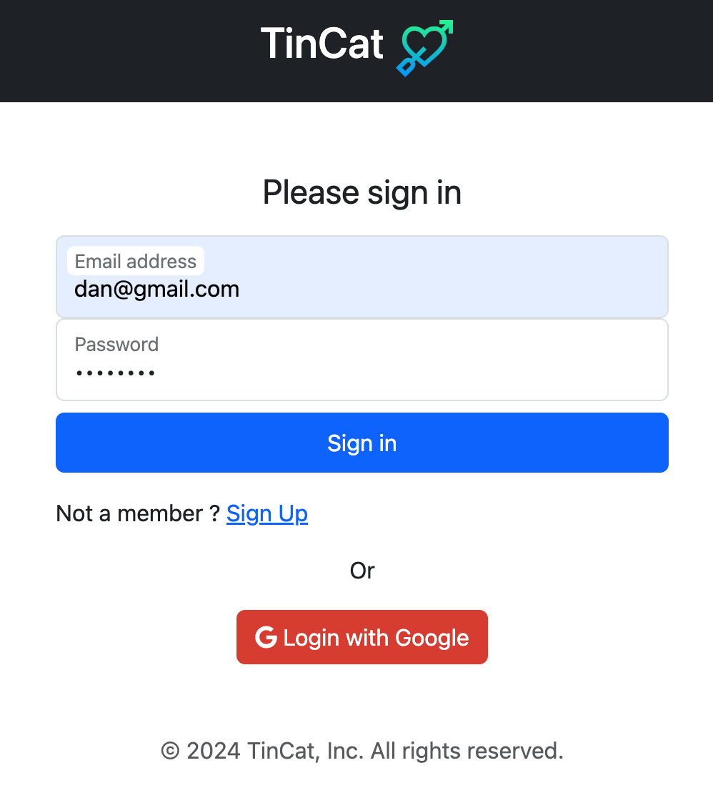
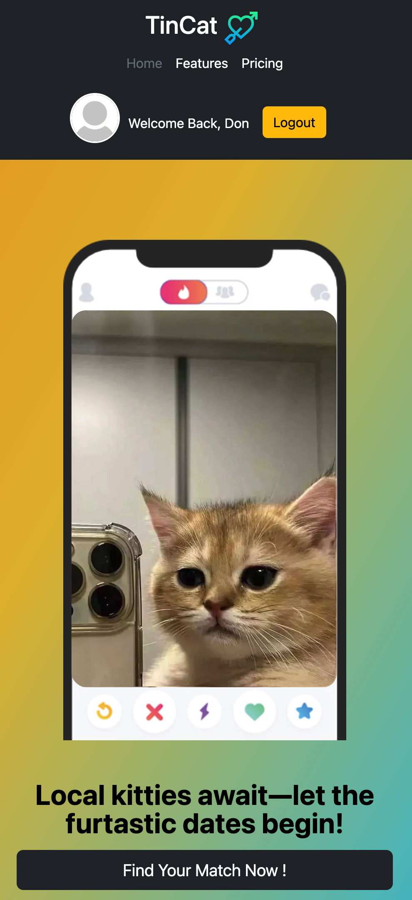

# TinCat - The Feline Dating App

Welcome to the official repository for TinCat, the feline dating app where local kitties find their purr-fect match. Our application provides an intuitive platform for our feline friends to meet, socialize, and fall in love. This README serves as a guide to the structure and setup of the project, including new full-stack functionalities.

## Project Overview

TinCat is a responsive web application built with Bootstrap, Node.js, and PostgreSQL, providing a seamless and intuitive user experience across all devices. The app features a vibrant gradient background, playful icons, and a gallery of charming cat profiles.

### Features

- **Gradient Background**: A beautiful and animated gradient that provides a lively backdrop to the user experience.

  

- **Responsive Layout**: Fully responsive design that looks great on desktop and mobile phones.

- **User Registration**: Users can sign up on the Sign Up page. The user's information is stored in a PostgreSQL database.

- **Login Page**: On the Login page, users can enter their credentials. If authenticated successfully, they are redirected to the homepage with a personalized welcome message.

- **Checkout Page**: Users interested in the Elite Plan can use a promo code for a $10 discount, fill out billing information, and are redirected to a payment success page.

- **Newsletter Subscription**: Users can subscribe to the TinCat newsletter from the homepage. Upon successful subscription, a confirmation message pops up to alert the user.

# Error Handling in TinCat

TinCat implements robust error handling to ensure a smooth user experience during account creation, login, and promotional code redemption processes. Below are details on how specific errors are managed.

## Promo Code Validation

During the checkout process, users can enter promo codes to receive discounts on their purchases. If a user enters an invalid promo code, the system will display an error message:

- **Error Condition**: Invalid or expired promo code entered.
- **User Feedback**: A pop-up message stating "Invalid promo code." appears, allowing the user to correct their input.

Example of error feedback on the checkout page:

## Unique Username and Email Constraint

When new user attempts to create an account, TinCat requires unique username and email address to avoid duplication. If an attempt is made to register with an already existing username or email, the system responds accordingly:

- **Error Condition**: User tries to sign up using a username or email that is already registered in the system.
- **User Feedback**: An error message "Username/Email already exists, please try again." is displayed on the sign-up page, prompting the user to provide a different username or email.
- **Implementation**: The back-end checks the submitted username and email against the PostgreSQL database. If a match is found, the error message is triggered and displayed.

Example of error feedback on the sign-up page:

# Error Handling on the Login Page

TinCat's login page incorporates comprehensive error handling to ensure a seamless and user-friendly authentication process. The system is designed to provide clear, actionable feedback for common issues such as incorrect passwords or unrecognized email addresses. Here’s how these errors are managed:

## Incorrect Password

When a user enters a password that does not match the one stored in the database, the following actions are taken:

- **Error Condition**: The password entered by the user does not match the corresponding password in the database for the provided email.
- **User Feedback**: The system displays a clear and concise error message: "The password you entered is incorrect. Please try again." This message is intended to inform the user that the specific issue is with the password, encouraging them to try again or reset their password if necessary.
- **Implementation Details**: This check is performed after verifying that the email exists in the database. If the passwords do not match, the `login.ejs` view is re-rendered with the appropriate error message.

Example of error feedback for incorrect password on login page:

## Unrecognized Email

If a user attempts to log in with an email address that is not found in the database, the system responds as follows:

- **Error Condition**: The email address entered does not match any records in the database.
- **User Feedback**: Instead of technical jargon, the error message is user-friendly: "No account found with that email. Please check your entry or register." This message helps guide the user toward verifying their email spelling or navigating to the registration page if they do not yet have an account.
- **Implementation Details**: This condition is checked first in the login sequence. If the query to the database returns no matching records, the `login.ejs` view is rendered again with the specified error message.

Example of error feedback for unrecognized email on login page:

## Getting Started

To get started with the TinCat project, check it out here: [TinCat](https://qwerac388.github.io/TinCat/)
